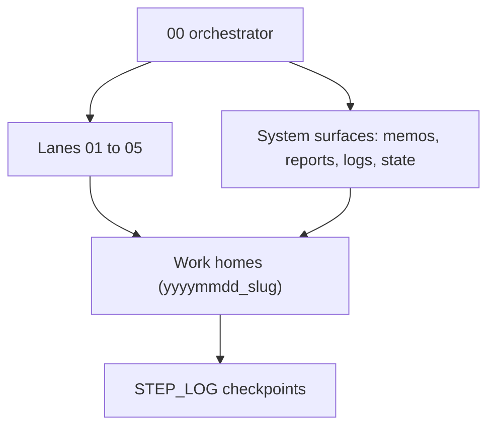

# Central Casting: demo source for slides

This document is built for slide generation. It carries the specific material a
deck needs and a reader will ask for: the problem, clear definitions, a worked
example, an architecture picture, concrete moves in Cursor, and answers to the
hard questions. It pairs with `WALKTHROUGH.md` and the sanitized files in
`example/`.

## The problem

A long-lived agent re-sends its whole growing context on every turn, so input
tokens climb worse than linearly, and a cold session re-reads the thread and
re-derives its decisions before it does any work. The gap is measurable, the
context a run carries and re-bills, and work that spans several repositories
also drifts apart. Central Casting closes it by giving the work a structure on
disk that holds its own memory.

## Glossary

| Term | One-line definition |
|---|---|
| 00 | The zero element and orchestrator. It routes work and reconciles state, and it leaves execution to the lanes. |
| Lane | A team that owns one kind of work such as research, data pipelines, modeling, writing or packaging. It runs a lead actor and spawns supporting actors as the work compounds, under the lane's local orchestrator. |
| System surface | A file class with one job: authoritative memos, derived reports, narrative logs, or current state. |
| Work home | One task folder inside a lane, named yyyymmdd_slug, carrying a manifest, a readme, a step log, and handoff notes. |
| Checkpoint | The unit of memory: a recorded state change in what a lane knows, can do, is blocked by, or is allowed to write. |
| Handoff | A written transfer of ownership or next-action authority between lanes or sessions. |

## Worked example

A sanitized example shows the method end to end. The project: compare two
analysis methods on a shared dataset and report which one holds under sparse
sampling.

**Before.** The work lives in one long thread. Decisions about the dataset, the
metric, and the threshold are scattered through the chat, and a session two
weeks later has to reread all of it.

**After, in eight moves:**
1. Name the project in one sentence: compare method A and method B on the shared dataset, and report which holds under sparse sampling.
2. Name the lanes: 01 research, 02 data pipelines, 03 modeling, 04 writing, with 00 orchestrating. See `example/actor_catalogue.yaml`.
3. Set the surfaces: the comparison contract is a memo, the results are reports, the daily narrative is a log, the current decision is state. See `example/system_surfaces.md`.
4. Open the work home `03/20260530_method-comparison` with its manifest, readme, step log, and handoffs. See `example/work_home_schema.yaml`.
5. Fix the schemas: the catalogue schema sets the lanes and folder rules, and the work-home schema sets the required files.
6. Record checkpoints as the work moves: hydration, pre-write inventory, worker report, blocker, authority change, commit. See `example/STEP_LOG.example.md`.
7. Keep the memory and audit local, and delegate the figure export to a cloud agent.
8. Write the handoff when the modeling lane passes results to the writing lane.

**Result.** A session that opens this work home two weeks later reads the last
six checkpoints and continues with the thread intact.

## Architecture

00 sits above the lanes and holds the map. Each lane owns its work homes. Every
file resolves to one system surface. Checkpoints record the state of each work
home over time.

## Concrete moves in Cursor

- Keep `00` as an external control surface in its own chat, separate from the lanes, so orchestration stays out of execution.
- Hold each lane's contract in a memo file that the lane reads on hydration.
- Start each session by reading the work home step log, then record a hydration checkpoint as the first write.
- Record a checkpoint at each real state change, and keep ordinary chat turns out of the log.
- Delegate heavy production passes to a cloud agent, and keep the audit layer on the local machine.

## Objections and answers

**Is this overkill for a small project?** For a one-session task, yes, the plain
thread is enough. The method earns its weight when work spans weeks or several
repositories.

**Does the model already remember across sessions?** Memory across long sessions
stays partial and drifts. The checkpoint log gives a durable, inspectable record
that a session can trust on its own.

**What breaks?** Context still drifts inside a long session, and a change in one
lane reaches another when it is carried there on purpose. The discipline reduces
these failures and depends on care.

**When should you skip it?** Skip it for throwaway exploration. Reach for it once
a project has a future and more than one moving part.
